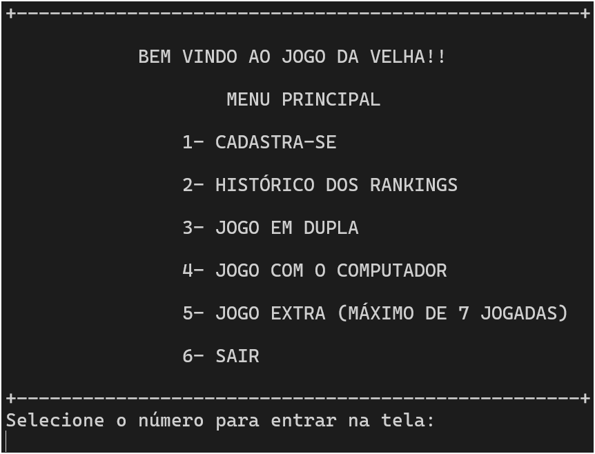
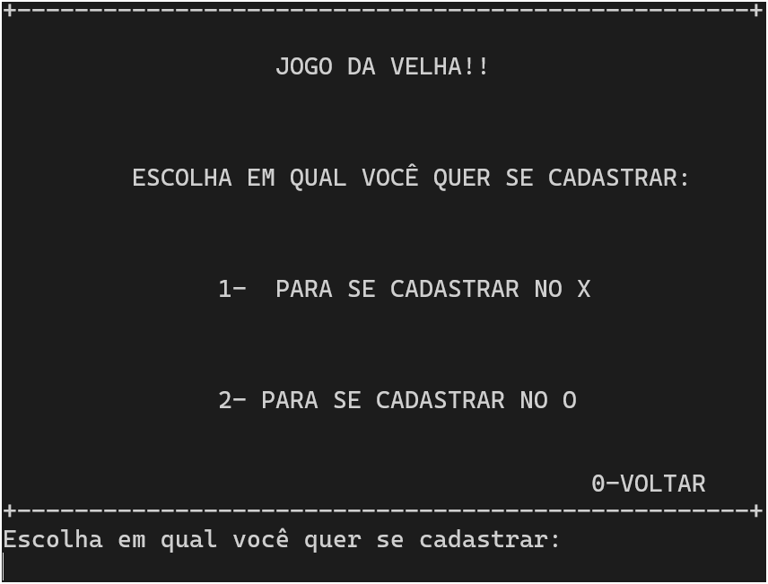
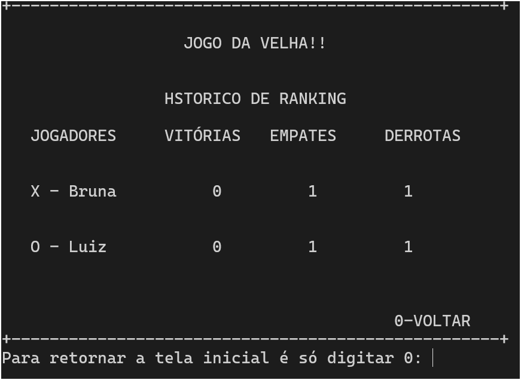
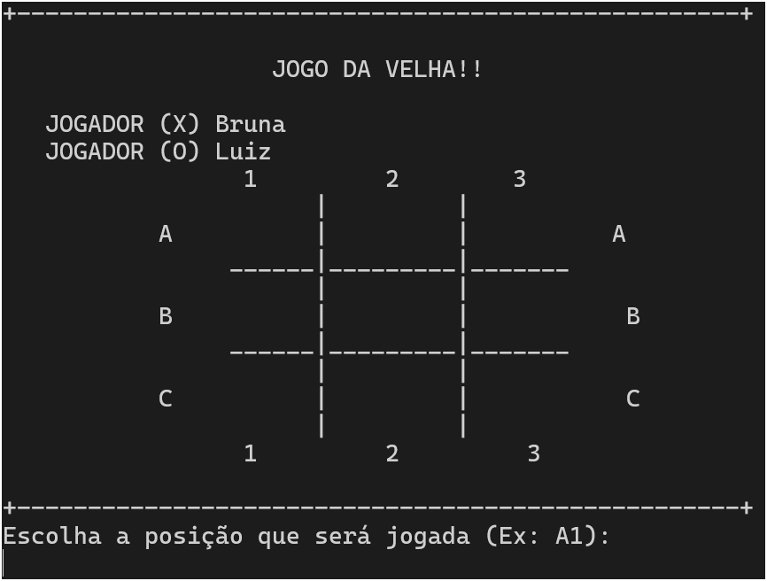
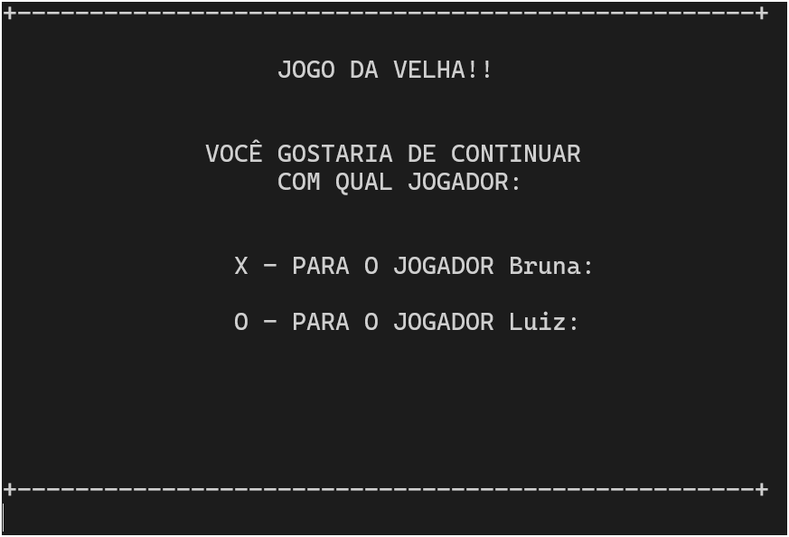
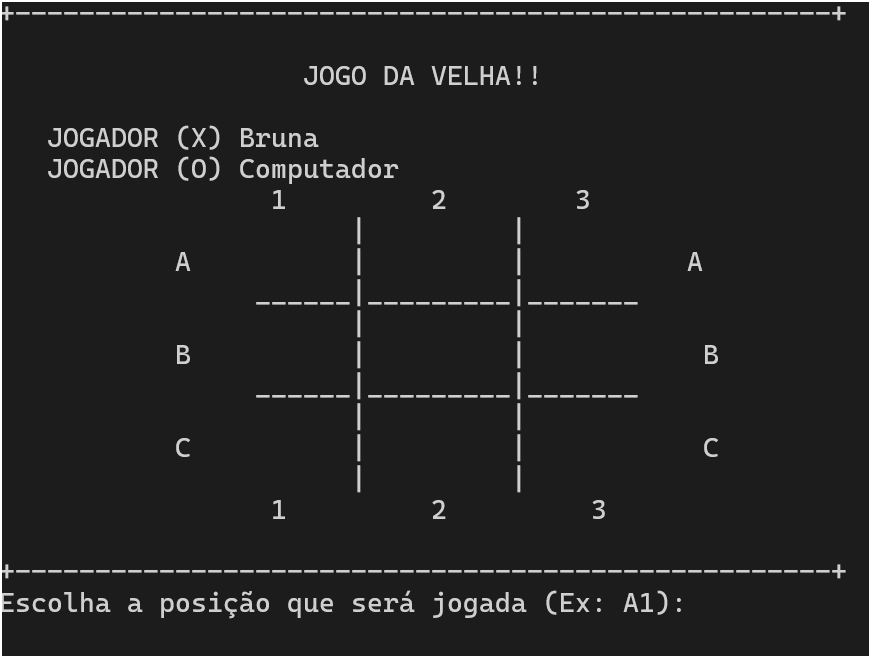
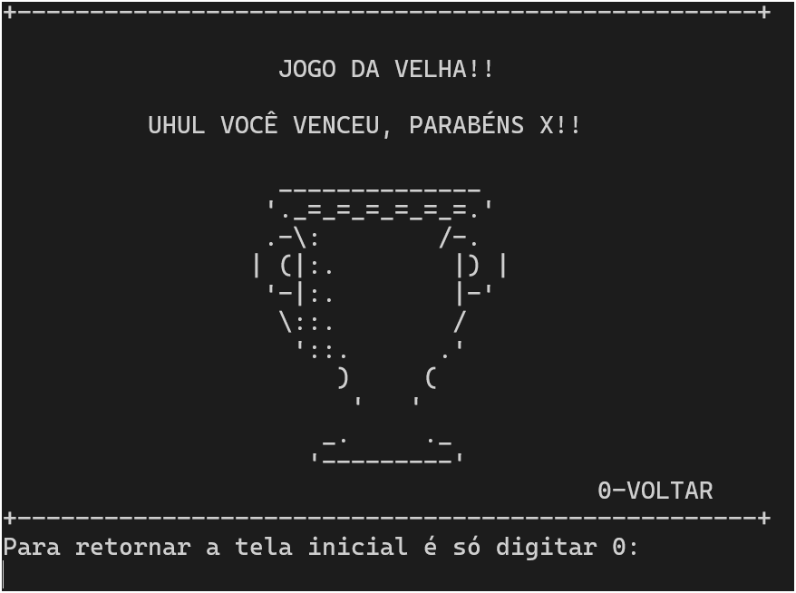
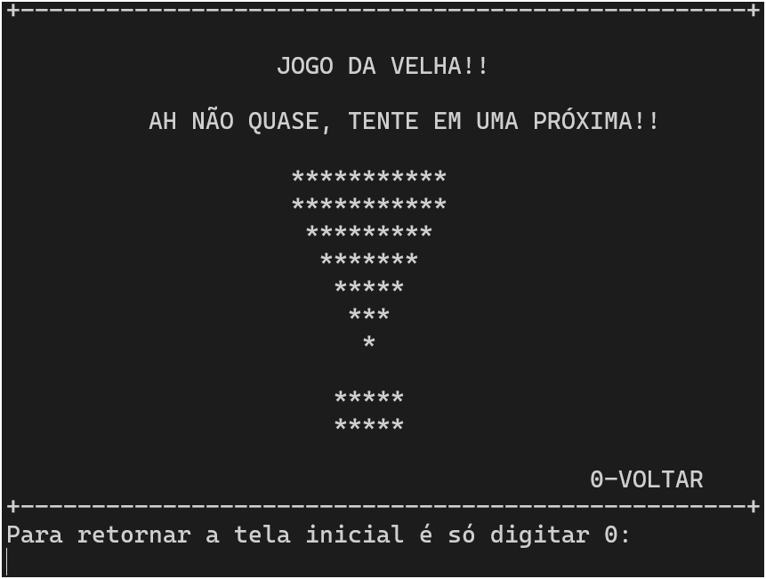
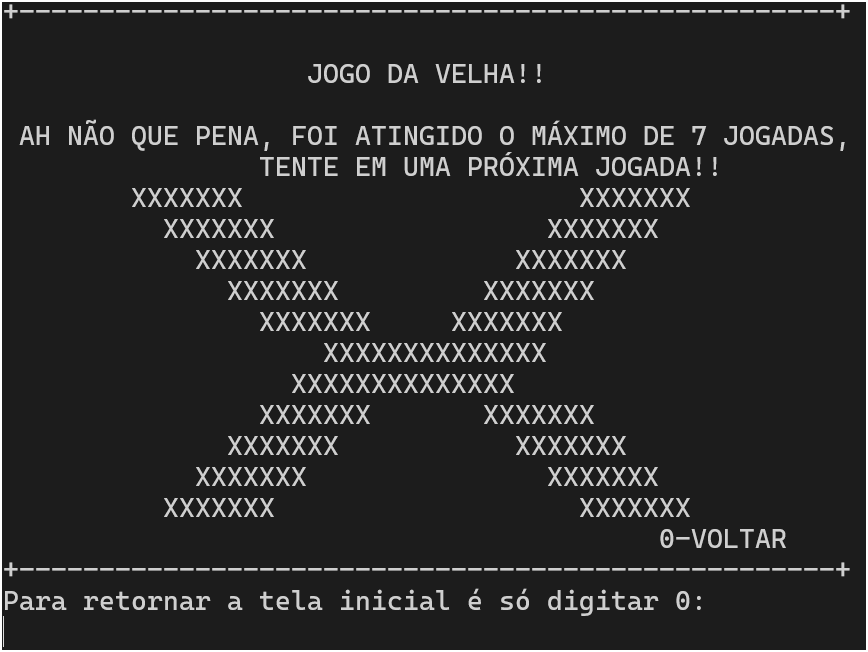

# Jogo da Velha em C

👤 Autor(a)
Desenvolvido por Bruna Campos
📧 Entre em contato: [brunareginadecampos@gmail.com]
🚀 Projeto feito com muito aprendizado e dedicação!


Este é um projeto em linguagem C que simula o clássico jogo de tabuleiro **Jogo da Velha**, com várias funcionalidades extras que deixam a experiência mais divertida e interativa.
---

## 🧩 Sobre o Projeto

Este jogo foi desenvolvido com o objetivo de praticar lógica de programação, vetores, matrizes, funções e controle de fluxo em linguagem C. O jogador pode jogar:

- Contra outro jogador
- Contra o computador
- Em um modo extra de até 7 jogadas

Além disso, o jogo possui **cadastro de jogadores**, **sistema de placar e ranking** e **interface em modo texto** divertida e clara.

---

## 📸 Capturas de Tela

### 🎛️ Menu Principal

Ao iniciar, você verá a tela com as opções principais do jogo:



---

### 🧍 Cadastro de Jogadores

É possível cadastrar nomes para o jogador "X" e o jogador "O":



---

### 📈 Histórico do ranking

É possível visualizar a quantidade de vitórias, empates e derrotas de cada jogador:



---

### 🕹️ Jogo em Dupla

Dois jogadores se enfrentam em tempo real:



---

### 🤖 Jogo Contra o Computador

Você pode desafiar a máquina em um jogo de estratégia:




---

### 🏁 Tela de Vitória

Quando alguém vence, uma tela especial é exibida:



---

### 🤝 Tela de Empate

Caso não haja vencedor, aparece a tela de empate:



---

### 🧩 Tela de Derrota do jogo extra

Caso não consiga vencer em 7 jogadas, ambos jogadores perdem:



---

## 🚀 Como Executar

1. Compile o código-fonte com um compilador C (ex: `gcc`):

```bash
gcc velha.c -o velha
./velha